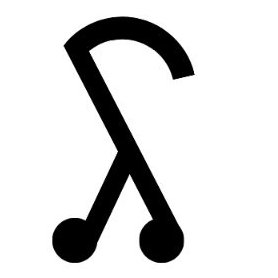
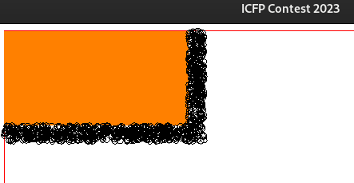
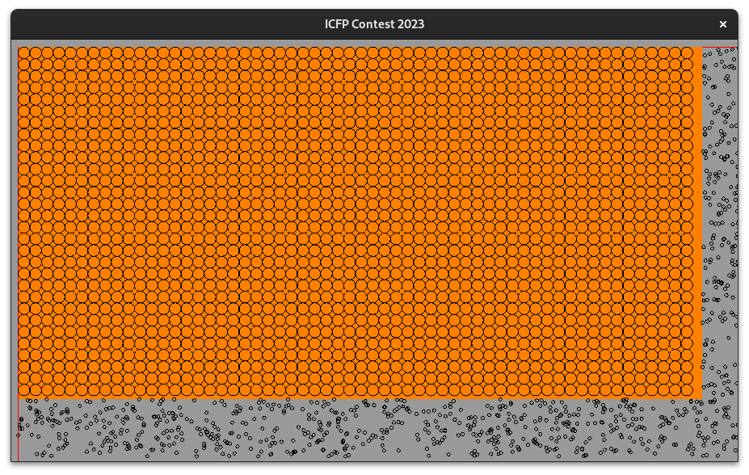
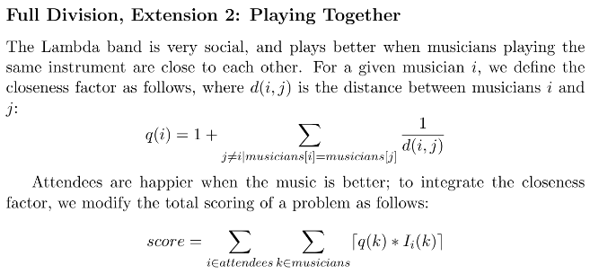
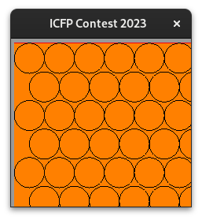
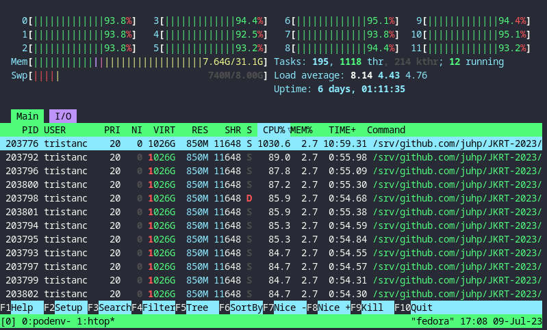

The International Conference on Functional Programming ([ICFP][icfp]) Programming Contest is an annual programming contest.
The event lasted for 3 days, and out of curiosity, we created a team with my dear colleague Jens Petersen.

[icfp]: https://icfp23.sigplan.org/

:::{.flex .items-center .justify-center}

:::

In this post I present how we worked on the problems. I include many code samples for the curious reader but feel free to skip over them or checkout the [repo](https://github.com/TristanCacqueray/icfpc2023)
The event was divided in two parts: a lightning division for the first 24 hours, and a full division for the remaining 48 hours.

## Lightning division

At the [[zurihac2023|ZuriHac]] we briefly talked about attending the contest, and a few days before we created a matrix chat room to get ready.
We were on opposite timezones so we could only met twice per day.

### Haskell project scaffold

This was the first time I ever participated in such a competition, and we didn't have a project template or toolbox.
However we knew we wanted to use Haskell.
Thus we setup a git repository with a standard cabal file adjusted with the following settings:

- Set the default-language to GHC2021: [Learn more about this](https://github.com/ghc-proposals/ghc-proposals/blob/master/proposals/0372-ghc-extensions.rst#motivation).
- Enable the following extensions:
    - *BlockArguments*, *ImportQualifiedPost*, *LambdaCase*, *MultiWayIf*: useful small syntax change.
    - *OverloadedRecordDot*: enables using the `record.field` syntax.
    - *DerivingStrategies*: for better instances definition, e.g. `deriving newtype`.
    - *PartialTypeSignatures* along with *-Wno-partial-type-signatures*: enables omitting type signature, e.g. `_ -> IO (Maybe _)`.
- Add the following extra build-depends in anticipation with *-Wno-unused-packages*:
    - *MonadRandom*, *aeson*, *bytestring*, *directory*, *rio*, *time*, *vector*: base enhancement
    - *gloss*: GUI
    - *http-conduit*, *retry*: network.
- Create a bunch of empty modules: `Parser`, `Syntax`, `Eval`, `GUI` and `Solve`.
- Setup the CI.

This enabled us to prepare the tool-chain before the event started so that we had a running `ghcid --test Solve.main` process ready to interpret our code.

### The first specification

The contest started on Friday with a specification.pdf that described the following challenge: place musicians on a stage to provide the best possible sound for the attendees.

Here was the example problem input:

```json
{
  "room_width": 2000.0,
  "room_height": 5000.0,
  "stage_width": 1000.0,
  "stage_height": 200.0,
  "stage_bottom_left": [500.0, 0.0],
  "musicians": [0, 1, 0],
  "attendees": [
    {"x":  100.0, "y":  500.0, "tastes": [1000.0, -1000.0]},
    {"x":  200.0, "y": 1000.0, "tastes": [200.0, 200.0]},
    {"x": 1100.0, "y":  800.0, "tastes": [800.0, 1500.0]}
  ]
}
```

And here was the example solution output:

```json
{
  "placements": [
    {"x": 590.0, "y": 10.0},
    {"x": 1100.0, "y": 100.0},
    {"x": 1100.0, "y": 150.0}
  ]
}
```

Along with some placements rules (e.g. musician must not overlap), we were given a scoring function to
evaluate the solution:

:::{.flex .items-center .justify-center}

:::

Moreover musicians can block each other when they are on the path of an attendee.

Finally we had a few problems to solve.

After reading this specification, I got excited because it looked like we would be able to solve some problems.
It was not the kind of problems where only a few solutions work.
For example, simply filling the stage randomly was a valid solution.


### Decoding JSON

I started with the easy part.
Using the excellent [json-to-haskell](http://json-to-haskell.chrispenner.ca/) website I generated the
specification's data types with their *FromJSON* and *ToJSON* instances.
Then I tweaked the types to use a more efficient list representation with unboxed vectors:

```haskell
import Data.Vector.Unboxed qualified as UV

data Problem = Problem
    { problemStageHeight :: Int
    , problemStageWidth :: Int
    , problemMusicians :: UV.Vector Int
    , problemRoomHeight :: Int
    , problemRoomWidth :: Int
    , problemAttendees :: [Attendee]
    , problemStageBottomLeft :: (Int, Int)
    }

data Solution = Solution
    { solutionPlacements :: UV.Vector (Int, Int)
    }
```

Using a vector let us read a value in `O(1)` with `UV.!` instead of `O(n)` with `Prelude.!!`.


### Gloss visualization

Next I wanted to see what the problems looked like. So I used the [gloss][gloss] library to draw a visualization:

[gloss]: https://hackage.haskell.org/package/gloss

```haskell
drawProblem :: Problem -> Solution -> Picture
drawProblem problem solution = Pictures (room : stage : attendees)
  where
    room :: Picture
    room =
        Color red $
            rectangleWire
                (int2Float problem.problemRoomWidth)
                (int2Float problem.problemRoomHeight)

    toAbs :: Float -> Float -> Picture -> Picture
    toAbs x y = Translate (topX + x) (topY - y)
      where
        topX, topY :: Float
        topX = -1 * fromIntegral problem.problemRoomWidth / 2
        topY = fromIntegral problem.problemRoomHeight / 2

    stage :: Picture
    stage =
        toAbs
            (stageWidth / 2 + int2Float stageX)
            (stageHeight / 2 + int2Float stageY)
            $ Color orange
            $ Polygon
            $ rectanglePath stageWidth stageHeight
      where
        stageWidth = int2Float problem.problemStageWidth
        stageHeight = int2Float problem.problemStageHeight
        (stageX, stageY) = problem.problemStageBottomLeft

    attendees :: [Picture]
    attendees = map drawAttendee problem.problemAttendees

    drawAttendee :: Attendee -> Picture
    drawAttendee attendee =
        toAbs
            (fromIntegral attendee.attendeeX)
            (fromIntegral attendee.attendeeY)
            (Circle 3)
```

And finally the display code:

```haskell
doRender :: Problem -> Solution -> IO ()
doRender problem solution = Gloss.display disp bg picture
  where
    disp = InWindow "ICFP Contest 2023" (winX, winY) (10, 10)
    bg = greyN 0.6
    picture = windowScale problem $ drawProblem problem solution

windowScale :: Problem -> Picture -> Picture
windowScale problem = Scale pscale pscale
  where
    pscale = fromIntegral scale * 0.98
    scale
        | problem.problemRoomHeight > problem.problemRoomWidth =
            winY `div` problem.problemRoomHeight
        | otherwise =
            winX `div` problem.problemRoomWidth
```

Gloss places the pictures' origin at the center, so they needed
to be translated and scaled with their absolute coordinates.
Once this is done, the gloss display implementation is great because
it comes with navigation out of the box:
you can move and zoom with the mouse.

Here is what the first and tenth problems looked like:

:::{.flex .items-center .justify-center}

:::

:::{.flex .items-center .justify-center}

:::


### Implementing the happiness score

Next we needed a way to evaluate a solution.
So we translated the specification into source code.
I had some trouble reading the math notations,
for example the half bracket meant that the happiness had to be rounded up.

Later, Jens optimized this implementation by switching the coordinate representation from Float to Int.
Here is the code we used for the lightning division:


```haskell
score :: Problem -> Solution -> Int
score problem solution =
    sum $ map (attendeeHappiness problem.problemMusicians solution) problem.problemAttendees

attendeeHappiness :: UV.Vector Int -> Solution -> Attendee -> Int
attendeeHappiness instruments solution attendee =
    UV.sum $ UV.imap musicianImpact solution.solutionPlacements
  where
    musicianImpact :: Int -> (Int, Int) -> Int
    musicianImpact musician placement
      | isBlocked = 0
      | otherwise =
        let (d,m) = (1_000_000 * taste) `divMod` distance
        in d + if m > 0 then 1 else 0
     where
       -- the musician's instrument
       instrument = instruments ! musician

       -- the attendee taste for this instrument
       taste = attendee.attendeeTastes ! instrument

       -- the distance between the attendee and the musician
       distance = calcDistance attendee placement

       -- is the musician blocked by another musician?
       isBlocked = UV.any checkBlocked solution.solutionPlacements
       checkBlocked :: (Int, Int) -> Bool
       checkBlocked otherPlacement = otherDistance < distance && isCrossed
          where
            otherDistance = calcDistance attendee otherPlacement
            isCrossed = lineCrossCircle attendee placement otherDistance 5 otherPlacement

calcDistance :: Attendee -> (Int, Int) -> Int
calcDistance attendee (px, py) = (attendee.attendeeX - px) ^ 2 + (attendee.attendeeY - py) ^ 2

-- | Check if the line between two points is blocked by a third point of a given radius (exclusive).
-- See: https://mathworld.wolfram.com/Circle-LineIntersection.html
lineCrossCircle :: Attendee -> (Int, Int) -> Int -> Int -> (Int, Int) -> Bool
lineCrossCircle attendee (mx, my) distance radius (px, py) = discriment > 0
  where
    (x1, y1) = (attendee.attendeeX - px, attendee.attendeeY - py)
    (x2, y2) = (mx - px, my - py)
    d = x1 * y2 - x2 * y1
    discriment = radius ^ 2 * distance - d ^ 2
```

Thanks to the mathworld.wolfram.com website, I found a suitable circle-line intersection function.

### Musician placements

I wanted to try a generative strategy, and to do that I needed to determine valid placements for the musicians.
So I wrote a function to transforms the stage into a grid:


```haskell
-- | Arranging the musicians in a grid, this function returns all the available placements.
allGridPlacement :: (Int, Int) -> UV.Vector (Int, Int)
allGridPlacement (width, height) = UV.fromList $ go radius radius []
  where
    -- go takes the current (x, y) position, and the list of accumulated position
    go :: Int -> Int -> [(Int, Int)] -> [(Int, Int)]
    go x y !acc
        | -- there is room to fit another musician on this line, keep the y pos
          x + nextMusician < width = go (x + diameter) y newAcc
        | -- there is room to start another line, reset the x pos
          y + nextMusician < height = go radius (y + diameter) newAcc
        | -- this is the end
          otherwise = newAcc
      where
        -- store the current pos in the accumulator
        newAcc = (x, y) : acc

-- | Placement dimension: ( -r- o -r- )
radius, diameter :: Int
radius = 10
diameter = radius * 2

{- | nextMusician is the distance from the current position + a whole new musician
 e.g:     o -r- )( -r- o -r-)|
-}
nextMusician :: Int
nextMusician = radius + diameter
```

Here is what the placements looked like:

:::{.flex .items-center .justify-center}

:::


### Random mutation

I proposed the following strategy:

  1. generate a bunch of random placements.
  2. perform some small mutations.
  3. keep the best placements and repeat the step 2.

Here is the implementation context:

```haskell
import Control.Monad.Random.Strict

type RandGen a = RandT StdGen IO a

-- | Helper to run the MonadRandom.
runRandGen :: RandGen a -> IO a
-- runRandGen action = evalRandT action (mkStdGen 42)
runRandGen action = do
    stdg <- initStdGen
    evalRandT action stdg
```

Note that the following implementation is incomplete,
it should have tracked the different branches instead of only keeping the best solutions.
This resulted in the solutions to quickly converging to a local maxima.
Nevertheless, here is the procedural implementation we used for the lightning division:

```haskell
geneticSolve :: String -> Problem -> RandGen (Int, Solution)
geneticSolve name problem = do
    initialSeeds <- replicateM seedCount (randomSolution problem placements)
    ((finalScore, finalSolution) : _) <- go genCount initialSeeds
    solution <- toSolution problem finalSolution
    pure (finalScore, solution)
  where
    genCount = 3
    seedCount = 5
    breedCount = 10
    dim = (problem.problemStageWidth, problem.problemStageHeight)
    placements = toAbsPlacement problem <$> allGridPlacement dim
    total = UV.length placements
    musicianCount = UV.length problem.problemMusicians

    go :: Int -> [(Int, GenSolution)] -> RandGen [(Int, GenSolution)]
    go 0 !seeds = pure seeds
    go count !seeds = do
        -- Generate a new population
        population <- concat <$> traverse breedNewSolutions seeds

        -- Order by score
        let populationOrdered = sortOn (\(score, _) -> negate score) population
        let best = case populationOrdered of
                (score, _) : _ -> score
                _ -> minBound
        liftIO do
            now <- getCurrentTime
            sayString $ printf "%s %s: gen %2d - %10d" (take 25 $ iso8601Show now) name count best

        -- Repeat the process, keeping only the best seed.
        go (count - 1) (take seedCount populationOrdered)
      where
        breedNewSolutions :: (Int, GenSolution) -> RandGen [(Int, GenSolution)]
        breedNewSolutions x@(_, s) = do
            newSolutions <- replicateM breedCount (makeNewSeed s)
            -- Keep the original seed
            pure (x : newSolutions)

        makeNewSeed :: GenSolution -> RandGen (Int, GenSolution)
        makeNewSeed (GenSolution seedPlacements) = do
            newSolution <- GenSolution <$> MV.clone seedPlacements
            doMutate newSolution
            score <- liftIO (scoreSolution problem newSolution)
            pure (score, newSolution)

        doMutate :: GenSolution -> RandGen ()
        doMutate (GenSolution iov) = do
            mutationCount <- getRandomR (genCount, MV.length iov `div` 5)
            replicateM_ mutationCount do
                -- Pick a random musician
                musician <- getRandomR (0, musicianCount - 1)
                -- Pick a random new position
                swapPos <- getRandomR (0, total - 1)
                -- Mutate
                MV.swap iov musician swapPos

-- | All the positions are stored, that way the mutations happen in-place.
-- in 'toSolution' we keep only the one for the active musicians.
newtype GenSolution = GenSolution (MV.IOVector (Int, Int))

-- | Create a random solution.
randomSolution :: Problem -> UV.Vector (Int, Int) -> RandGen (Int, GenSolution)
randomSolution problem placements = do
    iov <- V.thaw placements
    -- Randomize the placements with the 'vector-shuffle' library
    liftRandT \stdg -> do
        newstdg <- stToIO $  VectorShuffling.Mutable.shuffle iov stdg
        pure ((), newstdg)
    let gs = GenSolution iov
    score <- liftIO (scoreSolution problem gs)
    pure (score, gs)

-- | Create the 'Solution' data from a 'GenSolution'.
toSolution :: Problem -> GenSolution -> IO Solution
toSolution problem (GenSolution iov) = do
    xs <- UV.convert <$> V.freeze iov
    pure $ Solution $ UV.take (UV.length problem.problemMusicians) xs

-- | Compute the score of a 'GenSolution'.
scoreSolution :: Problem -> GenSolution -> IO Int
scoreSolution problem gs = do
    solution <- toSolution problem gs
    pure $ scoreHappiness problem solution
```


This technique worked and it found acceptable solutions.
The first day was almost over and we were missing some tooling to run the code
efficiently.

### Submitting the results

Jens added a command line interface so that we could run variations without rebuilding the project.
We also worked on some network code to automate the submissions.
We were running out of time, and the organizers released more problems to be solved.
At that time, we had 55 problems to crack.
To do that, we created a `solve problem` and `submit problem` commands.
Then we stored all the problems and their solutions in git.

For example, here was our submit function:

```haskell
newtype SubmitID = SubmitID Text
    deriving newtype (FromJSON)
    deriving (Show)

submit :: ProblemID -> Solution -> IO (Maybe SubmitID)
submit pid solution = do
    let obj = object ["problem_id" .= pid, "contents" .= decodeUtf8 (BSL.toStrict $ encode solution)]
    token <- getEnv "ICFP_TOKEN"
    manager <- newTlsManager
    initialRequest <- parseRequest "https://api.icfpcontest.com/submission"
    let request =
            initialRequest
                { method = "POST"
                , requestBody = RequestBodyLBS $ encode obj
                , requestHeaders =
                    [ ("Content-Type", "application/json")
                    , ("Authorization", "Bearer " <> encodeUtf8 (pack token))
                    ]
                }
    response <- httpLbs request manager
    if statusCode (responseStatus response) == 201
        then pure $ decode (responseBody response)
        else do
            putStrLn $ "The status code was: " ++ show (statusCode $ responseStatus response)
            print $ responseBody response
            return Nothing
```

As expected we had a bunch of bugs. Some solutions appeared unsolvable, some got a huge negative
score. Sometime the grid algorithm put musicians off the stage.
Moreover the scoreboard was moving fast.

At the end of day 1 the light division was over.

## The full specification

After 24 hour, the organizers released a new specification with the following changes:

* The room now had pillars that can block the sound.
* The musician had an extra closeness factor that affected the attendee's happiness:

:::{.flex .items-center .justify-center}

:::

New problems were also released, for a grand total of 90 to be solved.

These extensions looked reasonable and we decided to give it a shot using the exact same strategy.

### Overall code improvements

It was time to level-up our initial code. We added:

- exception handling.
- automatic saving.
- solution reloading.
- command line parameters.

I introduced a couple of new data types:

```haskell
newtype ProblemID = ProblemID Int
    deriving newtype (Show, Eq, Ord, Enum, Num, ToJSON)

data ProblemDescription = ProblemDescription
    { name :: ProblemID
    , problem :: Problem
    , -- a dense pillars representation using (x, y, radius)
      pillars :: UV.Vector (Int, Int, Int)
    }

data SolutionDescription = SolutionDescription
    { score :: Int
    , musicianCount :: Int
    , genPlacements :: MV.IOVector (Float, Float)
    , genVolumes :: MV.IOVector Float
    }
```

Haskell made such code refactoring really easy.

### Updating the scoring function

To take into account the room's pillars, we updated the `attendeeHappiness` implementation with:

```haskell
        -- is the musician blocked
        isBlocked = isBlockedPillar || isBlockedMusician

        -- … by a pillar (Extension 1)?
        isBlockedPillar = UV.any checkBlockedPillar problemDesc.pillars
        checkBlockedPillar :: (Int, Int, Int) -> Bool
        checkBlockedPillar (px, py, radius) = isCrossed
          where
            otherPlacement = (px, py)
            otherDistance = calcDistance attendee otherPlacement
            isCrossed = lineCrossCircle attendee placement otherDistance radius otherPlacement

        -- … by another musician?
        isBlockedMusician = UV.any checkBlocked solution.solutionPlacements
```

To handle the closeness factor, we pre-computed the list of factor:

```haskell
    -- Extension 2: pre-compute all the factor in advance
    calcClosenessFactor musician
        | problemDesc.name > 0 && problemDesc.name < 56 = 1 -- extension is disabled for the first problems
        | otherwise = 1 + UV.sum (UV.generate musicianCount calcMusicianDistance)
      where
        instrument = problemDesc.problem.problemMusicians UV.! musician
        musicianPos = solution.solutionPlacements UV.! musician
        calcMusicianDistance otherMusician
            | otherMusician == musician || instrument /= otherInstrument = 0
            | otherwise =
                let d = calcDistance2 musicianPos (solution.solutionPlacements UV.! otherMusician)
                 in 1 / d
          where
            otherInstrument = problemDesc.problem.problemMusicians UV.! otherMusician
```

And we applied the formula as explained in the specification.

### Better musician's placement


Looking at the [circle packing Wikipedia's page][circle-packing], I updated our placements generator
to better pack the musicians. This unblocked most of the problems except the number 38.
This one had a very tight stage and I think we needed a Float precision to accommodate all the musicians.

[circle-packing]: https://en.wikipedia.org/wiki/Circle_packing

Here is the final placements technique we used:

```haskell
-- | Packing the musicians in a grid, this function returns all the available placements.
allPackedPlacement :: (Int, Int) -> UV.Vector (Int, Int)
allPackedPlacement (width, height) = UV.fromList $ go 0 radius radius []
  where
    go
        | -- do the offset per line
          width > height = goLine
        | -- do the offset per column
          otherwise = goCol

    goLine :: Int -> Int -> Int -> [(Int, Int)] -> [(Int, Int)]
    goLine line x y !acc
        | -- there is room to fit another musician on this line
          x + nextMusician < width  = goLine line (x + diameter) y newAcc
        | -- there is room to start another line
          y + nextMusician < height = goLine (line + 1) newX (y + newOffset) newAcc
        | -- this is the end
          otherwise = newAcc
      where
        newAcc = (x, y) : acc
        -- we alternate the start position every two lines
        newX | even line = diameter
             | otherwise = radius

    goCol :: Int -> Int -> Int -> [(Int, Int)] -> [(Int, Int)]
    goCol col x y !acc
        | -- there is room to fit another musician on this column
          y + nextMusician < height = goCol col x (y + diameter) newAcc
        | -- there is room to start another column
          x + nextMusician < width  = goCol (col + 1) (x + newOffset) newY newAcc
        | -- this is the end
          otherwise = newAcc
      where
        newAcc = (x, y) : acc
        -- we alternate the start position every two columns
        newY | even col = diameter
             | otherwise = radius

    -- best offset using int
    newOffset = 19
```

Even though there are some gaps, this implementation may produce better results. Here is how it looked:

:::{.flex .items-center .justify-center}

:::


On some stages, the previous strategy was better, so we used this helper to pick the best one:

```haskell
maximumPlacements :: Problem -> UV.Vector (Int, Int)
maximumPlacements problem = UV.map toAbsPlacement best
  where
    best | UV.length packed > UV.length grid = packed
         | otherwise = grid
    packed = allPackedPlacement dim
    grid = allGridPlacement dim
    dim = (problem.problemStageWidth, problem.problemStageHeight)

    toAbsPlacement :: (Int, Int) -> (Int, Int)
    toAbsPlacement (x, y) = (sx + x, sy + y)
      where
        (sx, sy) = problem.problemStageBottomLeft
```


### Musician volumes


Halfway through the full division, the organizers released a third extension, and it turned out to be quite important.
Musicians now had a volume attribute, and it affected the attendee happiness:

:::{.flex .items-center .justify-center}

:::

Using the same random strategy, we added volume permutations.
After the solution reached a big score, we added command line arguments to control the
amount of mutations used to improve the solutions.
We alternated between placement and volume mutations using these commands:

- `cabal run progcon -- solve --placement 0 --volume 1 $PB_NUM`
- `cabal run progcon -- solve --placement 1 --volume 0 $PB_NUM`


### Driver mode

Instead of trying to solve the problem one by one, I implemented a driver mode to run
the code autonomously:

```haskell
mainDriver :: Int -> IO ()
mainDriver maxTime = do
  let dryRun = False
  putStrLn $ printf "Starting driver with max %d seconds"  maxTime

  -- start from the smallest score
  solutions <- _sortProblemByScore

  -- start from the oldest solution
  -- solutions <- _sortProblemByDate

  now <- getCurrentTime
  let solutionsOrdered =
        -- Focus on the first few problems
        take 12 $
        -- Start from the biggest/recent one
        reverse solutions
        -- Start from the smallest/oldest
        -- solution

  forM_ solutionsOrdered \(pid, time) -> do
    let
      ageSec :: Integer
      ageSec = truncate (nominalDiffTimeToSeconds $ diffUTCTime now time) `div` 60
    solution <- loadSolutionPath (solutionPath pid)
    putStrLn $ printf "Trying to improve problem-%02s (%4s minutes old): %13s"
      (show pid)
      (show ageSec)
      (showScore solution.score)
    problem <- loadProblem pid
    start_time <- getCurrentTime
    unless dryRun do
      improved <- runRandGen $ mainImprove maxTime problem start_time start_time solution 0
      when improved do
        void $ forkIO $ submitOne pid

-- | This function call 'tryImprove' repeatedly. It returns True on success.
mainImprove :: Int -> ProblemDescription -> UTCTime -> UTCTime -> SolutionDescription -> Int -> RandGen Bool
mainImprove maxTime problemDesc initial_time start_time solutionDesc idx = do
  -- maybe get a new solution
  mSolution <- tryImprove problemDesc solutionDesc (toEnum (idx `mod` 3))

  (newTime, newSolution) <- case mSolution of
    Nothing -> pure (start_time, solutionDesc) -- no improvement
    Just sd -> liftIO do
      saveSolutionPath sd (solutionPath problemDesc.name)
      now <- getCurrentTime
      sayString $ printf "%s #%02s new highscore:%14s (+%10s)"
          (formatLogTime now)
          (show problemDesc.name)
          (showScore solutionDesc.score)
          (showScore $ sd.score - solutionDesc.score)
      pure (now, sd)

  -- check how long we ran sinch the last improvement
  end_time <- liftIO getCurrentTime
  let elapsed = nominalDiffTimeToSeconds (diffUTCTime end_time start_time)
      hasImproved = initial_time /= start_time -- start_time is increased by improvements
  if elapsed < fromIntegral maxTime
    then mainImprove maxTime problemDesc initial_time newTime newSolution (idx + 1)
    else pure hasImproved
```

And here is the simpler `tryImprove` implementation:

```haskell
data Mutation = Placement | Volume | Both
    deriving (Enum, Bounded, Show)

-- | This function simply try to improve a given solution by applying a single mutation
tryImprove :: ProblemDescription -> SolutionDescription -> Mutation -> RandGen (Maybe SolutionDescription)
tryImprove problemDesc sd mutation = do
    newSolution <- case mutation of
        Placement -> do
            genPlacements <- newPlacements
            pure $ sd{genPlacements}
        Volume -> do
            genVolumes <- newVolumes
            pure $ sd{genVolumes}
        Both -> do
            genPlacements <- newPlacements
            genVolumes <- newVolumes
            pure $ sd{genPlacements, genVolumes}

    score <- scoreSolution problemDesc newSolution.genPlacements newSolution.genVolumes
    pure $
        if score > sd.score
            then Just (newSolution{score})
            else Nothing
  where
    musicianCount = UV.length problemDesc.problem.problemMusicians
    newPlacements = do
        -- Copy the previous placements and do one swap
        iov <- MV.clone sd.genPlacements.iov
        musician <- getRandomR (0, musicianCount - 1)
        swapPos <- getRandomR (0, MV.length iov - 1)
        MV.swap iov musician swapPos
        pure $ GenPlacements iov
    newVolumes = do
        -- Copy the previous volumes and do one change
        iov <- MV.clone sd.genVolumes
        musician <- getRandomR (0, musicianCount - 1)
        volume <- getRandomR (0, 10)
        -- TODO: to a relative increase of the current volume?
        MV.write iov musician volume
        pure iov
```

To make the code runs in parallel, I used the [scheduler][scheduler] library:

```diff
  mainDriver :: Int -> IO ()
- mainDriver maxTime = do
+ mainDriver maxTime = withScheduler_ Par \scheduler -> do
    let dryRun = False

-   forM_ solutions \(pid, time) -> do
+   forM_ solutions \(pid, time) -> scheduleWork_ scheduler do
      let ageSec :: Integer
```

[scheduler]: https://hackage.haskell.org/package/scheduler

… resulting in such load average:

:::{.flex .items-center .justify-center}

:::

We also updated the submit code to automatically git push the new solutions.
That way we could let the code run in the background.

### Last hours

The driver was making steady progress and at some point we reached position 68 on the scoreboard
but the other teams were also busy updating their solutions.
Unfortunately, our solver was not improving the solutions fast enough and we started to fall off the scoreboard.
Moreover, the organizers judiciously disabled the scoreboard in the last two hours.
Our final position at that time was 91 with a total happiness score of 39.442 billions.

## Lessons learned

I think the main issue was that we didn't re-evaluate the initial strategy, and we didn't leverage the gloss visualization to better understand how to solve the problems.
We simply stuck with the initial implementation and worked around it.
Looking at it with a fresh mind, I can see how inefficient that was.
For example, instead of picking a new random volume at each iteration, we should have tried to increase or decrease the value, and kept what worked the best.

Moreover, before running the driver for the last run, I made a last minute change to better utilize the cores.
Unfortunately, that small change made the new highscore to be discarded, resulting in many cpu cycles to be wasted.

Lastly, being in opposite timezones was useful.
The problem's extensions were released during my day time and I worked on them until the evening.
Then I wrote some documentations and explained the code to Jens so that he could continue during his day time.
It was like a programing relay race.

If I had to do this again, here is what I would do:

- Setup an infra: we could have used a VPN to share compute cores (though we only had two i5 laptops and one ryzen desktop), and to setup a database to keep track of the solutions.
- Invest in tooling: having a fast feedback loop and power-tools like the driver made a big difference.
- Make a bigger team: that way we could have assigned the problems and tried different strategies.
- Have fun: computers can be frustrating, but don't let that drain your motivation. For example, I got weird bugs trying to display the solutions in real-time with gloss, and I lost of a bunch of time in vain trying to make that work. Jens also struggled with network errors from the API. Eventually we kept working on it and we achieved some success.

## Conclusion

I like working under time pressure, because you have to be pragmatic, and I think Haskell was a great fit for the competition.
We were able to easily discuss and change the source code thanks to the powerful type annotations.

Even though our results were not spectacular, I really enjoyed participating in the icfpc-2023.
It was a lot of fun collaborating with Jens, and this weekend was quite memorable.
Big thanks to my wife for understanding, to the organizers and all the participants for the great competition!

If you would like to join our team next time, please let me know :)
