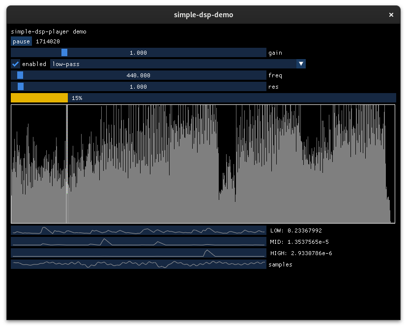
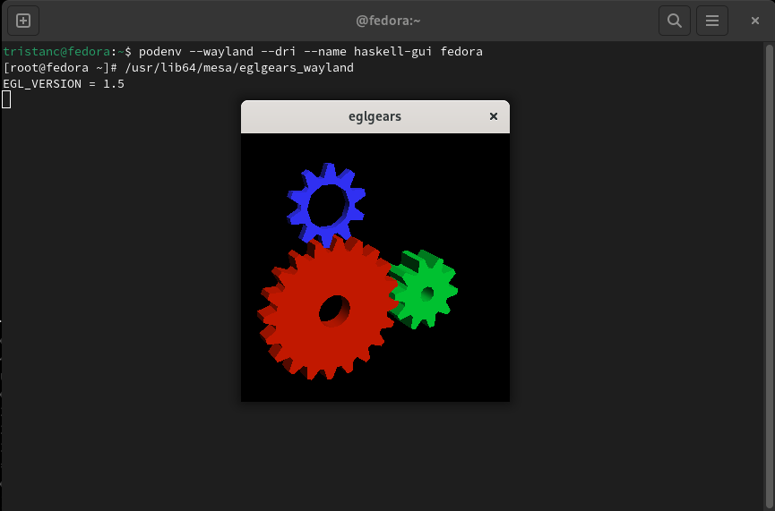
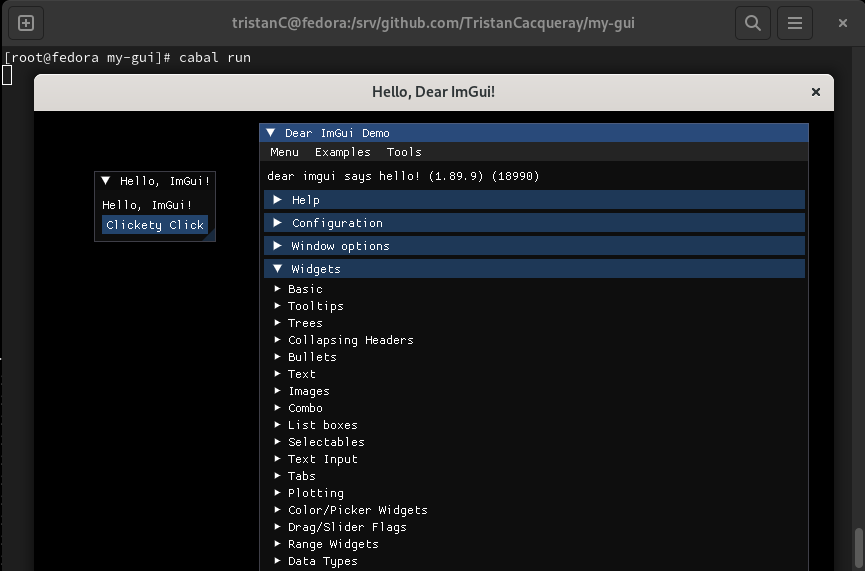

This post shows how to setup a live reloading workflow to develop graphical user interfaces (GUI) with Haskell on Fedora Linux from scratch.
This post demonstrates how to create a developer environment with a blazingly fast and flexible feedback loop to develop this [dear-imgui][dear-imgui] application:

![[dear-from-scratch-demo.webm]]

:::{.hidden}

:::

In four parts, I present how to:

- Setup a container with system dependencies.
- Install the latest Haskell toolchain with ghcup.
- Create a Haskell package with cabal init.
- Setup a live reloading workflow with ghcid.

To follow along, you will need a Fedora Workstation, or any Linux system with:

- Podman container runtime.
- Wayland powered desktop environment.
- 6 GB of free disk-space (3GB for ghcup, 1.6GB for packages, 2GB for the container image).

> Please let me know if you have any issues running the examples, I am very interested in updating that guide so that it works in any situation.


## Setup System Shell

First, you need to setup a shell, which is a command line interface, to enter the build commands.
While you can directly use the desktop terminal from the host operating system,
it is better to use a rootless container to keep everything isolated from the rest of the OS.
If you don't want to use a container, skip the next section.

### Developer container

If you don't have it already, I recommend using [[podenv]], install it with the following command:

```ShellSession
$ curl -L https://github.com/podenv/podenv/releases/download/v0.5.0/podenv-x86_64-linux.tar.bz2 | tar -xvjf -C ~/.local -
```

Podenv is a standalone executable that simplifies desktop container creation so that a fully featured shell can be started with this command:

```ShellSession
$ podenv --wayland --dri --name haskell-gui fedora
```

> If you don't want to use podenv, you can run podman directly with:
>
> ```ShellSession
> podman run -it --rm --device /dev/dri --env GDK_BACKEND=wayland --env HOME=/root --env QT_QPA_PLATFORM=wayland --env SDL_VIDEODRIVER=wayland --env TERM=xterm-256color --env WAYLAND_DISPLAY=wayland-0 --env XDG_RUNTIME_DIR=/run/user/$UID --env XDG_SESSION_TYPE=wayland --mount type=tmpfs,destination=/tmp --mount type=tmpfs,destination=/dev/shm --volume /etc/machine-id:/etc/machine-id --volume haskell-gui:/root --mount type=tmpfs,destination=/run/user --volume $HOME/src:/root/src --volume /run/user/$UID/wayland-0:/run/user/$UID/wayland-0 --volume /usr/share/egl:/usr/share/egl --security-opt label=disable --user 0 --hostname fedora --name haskell-gui --workdir /root --detach-keys "" registry.fedoraproject.org/fedora:latest
> ```
> Podenv simply takes care of passing the necessary arguments to podman. For example, if your graphic card is from NVidia, then you need to add `$(for dev in /dev/nvidia*; do echo --device $dev; done)` to the podman arguments.

Inside the container, validate everything is working by running a mesa-demos:

```ShellSession
$ dnf install -y mesa-demos && /usr/lib64/mesa/eglgears_wayland
```

… which will display a window with the gears example, confirming that everything is setup correctly:



When you exit the container, the mesa-demos package will be removed
because only the home directory is preserved.
To keep the system packages, you have to bake them into the image.
You can use [buildah][buildah] to update the container image by running these commands:

```ShellSession
CTX=$(buildah from --pull=false registry.fedoraproject.org/fedora:latest)
buildah run $CTX dnf install -y git vim-enhanced gcc-g++ gmp-devel zlib-devel SDL2-devel glm-devel mesa-libGLU-devel mesa-libGL-devel glfw-devel glew-devel mesa-dri-drivers vulkan-loader-devel VulkanMemoryAllocator-devel vulkan-validation-layers-devel libXxf86vm-devel mesa-demos
buildah commit --rm $CTX registry.fedoraproject.org/fedora:latest
```

> Feel free to adjust the package list and re-run the above commands to add more packages to your container image.

You can access the container's files from the host in: `~/.local/share/podenv/volumes/haskell-gui-home/` (or `~/.local/share/containers/storage/volumes/haskell-gui/_data/` if you used podman manually).
To join an existing container from another terminal window, run: `podman exec -it haskell-gui bash`. The rest of this article assumes the commands are executed inside the container.

### System dependencies

For this demo, you'll need the following system dependencies:

```ShellSession
$ dnf install -y git gcc gcc-c++ gmp gmp-devel make ncurses ncurses-compat-libs xz perl pkg-config zlib-devel SDL2-devel glm-devel mesa-libGLU-devel mesa-libGL-devel glfw-devel glew-devel libXxf86vm-devel
```

This ensures common development libraries are installed, in this case:

- gmp and zlib which are commonly required.
- mesa* for low level rendering.
- SDL for the GUI. GLFW is also an option, but the Fedora package doesn't support wayland yet.

You now have a shell with system dependencies (which you can check by running `pkg-config --list-all`).
In the next section we will install the Haskell toolchain.

## Install Haskell Toolchain

To setup the Haskell toolchain use [ghcup][ghcup].
Run the following command to install all the necessary components:

```ShellSession
$ curl --proto '=https' --tlsv1.2 -sSf https://get-ghcup.haskell.org | sh
```

Accept all the default answers by pressing enter and run `source ~/.bashrc` once this is done.
You now have the following tools:
- ghc, the Haskell compiler, and,
- cabal, the package manager, using [Hackage](https://hackage.haskell.org) as the registry.

```ShellSession
$ ghc --version
The Glorious Glasgow Haskell Compilation System, version 9.4.8
$ cabal --version
cabal-install version 3.10.3.0
```

Finally fetch the Hackage packages registry by running:

```ShellSession
$ cabal update
```

> If you don't run cabal update, package builds will fails with such errors: `unknown package`.

You now have the haskell toolchain (which you can check by running `ghc-pkg list`).
In the next section we will setup a project with the dear-imgui build depends.


## Create Haskell Package

Initialize a new package by running the following command:

```ShellSession
$ cabal init my-gui
```

Here are the non default options I recommend:

- What does the package build: `Library and Executable`
- Package version: `0.1`
- License: `GPL-3.0-only`
- Choose a language: `GHC2021`

Then validate your package is ready:

```ShellSession
$ cd my-gui
$ cabal test
1 of 1 test suites (1 of 1 test cases) passed.
```

To start using dear-imgui, we need to import the boilerplate from the upstream readme:

- Add the `dear-imgui` build-depends to the library section in `my-gui.cabal`:

```diff
-    build-depends:    base ^>=4.19.1.0
+    build-depends:    base ^>=4.19.1.0, dear-imgui
```

- Add the following dependencies to the executable section in `my-gui.cabal`:

```diff
     build-depends:
         base ^>=4.19.1.0,
-        my-gui
+        my-gui, dear-imgui, sdl2, managed, gl
```

- Replace your `app/Main.sh` with the example:

```ShellSession
$ curl https://raw.githubusercontent.com/haskell-game/dear-imgui.hs/main/examples/Readme.hs > app/Main.hs
```

Then running the application with:

```ShellSession
$ cabal run
```

… creates the following window:



You now have a working Haskell project.
In the next section we'll setup a live reload workflow.

## Haskell Package Targets

Before setting up the workflow, you need to understand what a target is.
A target defines a list of modules, their dependencies, and their compilation flags.
Haskell packages can be divided into four kinds of targets:

- `exe:name` are the executables.
- `lib:name` are the libraries (a package can contain multiple libraries).
- `test:name` are the tests.
- `bench:name` are the benchmarks.

This lets you apply separation of concern, for example:

- exe provides command line argument parser.
- lib provides the core logic that can be shared independently.
- test and bench provides testing code.

When publishing a package to the Hackage registry, only one public library is presently supported.
The first library definition in a cabal file does not need a name argument as it picks the package name.

Haskell projects that are defined with a `cabal.project` file let you define a workspace with multiple packages.
This is necessary for publishing multiple libraries because Hackage doesn't yet support multiple public libraries defined in a single package.
You can also setup a `cabal.project` file to override external libraries location using a local copy, which is very useful
to work on your dependencies.

Here are a couple of example projects with multiple targets:

- [servant][servant], which includes one package per feature, checkout the `cabal.project` file.
- [saturn][saturn], which features a single package with multiple library, checkout the `saturn.cabal` file.

[servant]: https://github.com/haskell-servant/servant
[saturn]: https://github.com/tfausak/saturn

## Live Reloading Workflow

Use ghcid to quickly interpret the code on every file save by running the following commands:

```ShellSession
$ cabal install ghcid
$ ghcid --warnings --test Main.main --command "cabal repl exe:my-gui"
```

It is necessary to specify the executable target with `exe:my-gui`, otherwise, ghcid picks the
default library target `lib:my-gui`. This means only one target can be live reloaded.

The new `multi-repl` feature available in the upcoming cabal release version 3.12 lets you
live reload multiple target in a single session:
At the time of writing, cabal version 3.12 can be installed with the following command:

```ShellSession
$ ghcup --no-cache install cabal -u 'https://gitlab.haskell.org/haskell/cabal/-/jobs/1848320/artifacts/raw/out/cabal-install-3.11.0.0-x86_64-linux-alpine3_12.tar.xz' 3.12.0.0-prerelease
```

This feature is very powerful as it lets you seamlessly run the application or the test suite when editing the library.
You can now use the following command:

```ShellSession
$ ghcid --warnings --test Main.main --command "cabal repl --enable-multi-repl exe:my-gui lib:my-gui"
```

To demonstrate how that works, we'll implement a test GUI in the library to be displayed by the
application. Apply the following change to the project:

```diff
diff --git a/app/Main.hs b/app/Main.hs
index 016e0a7..15ff0b0 100644
--- a/app/Main.hs
+++ b/app/Main.hs
@@ -5,6 +5,8 @@

 module Main ( main ) where

+import MyLib
+
 import DearImGui
 import DearImGui.OpenGL3
 import DearImGui.SDL
@@ -51,12 +53,7 @@ mainLoop window = unlessQuit $ do

   -- Build the GUI
   withWindowOpen "Hello, ImGui!" $ do
-    -- Add a text widget
-    text "Hello, ImGui!"
-
-    -- Add a button widget, and call 'putStrLn' when it's clicked
-    button "Clickety Click" >>= \clicked ->
-      when clicked $ putStrLn "Ow!"
+    MyLib.myGUI

   -- Show the ImGui demo window
   showDemoWindow
```

And copy the following module to `src/MyLib.hs`:

```haskell
{-# language OverloadedStrings #-}

module MyLib where

import DearImGui qualified

myGUI :: IO ()
myGUI = do
  DearImGui.text "Fast reload"
```

Here is how that looks in action:

![[dear-from-scratch-demo.webm]]

You now have a fast live reloading feedback loop to develop Haskell GUI.

## Conclusion

This post shows how the Haskell toolchain provides powerful tools to develop GUI.
I believe the killer feature is the REPL interpreted mode which lets you run the code
without linking, which is often the slowest part of a live reload workflow.
For example, even with all the tweaks prescribed in the Bevy Rust engine [compile optimizations doc][bevy-doc],
including using the new mold linker, I couldn't make my toy [moonracer][moonracer] game reload
in less than a few seconds.

While the ecosystem is continuously improving, this setup is still a bit experimental.
Sometimes, ghcid will get stuck and it won't be able to refresh the window.
In that case, a custom wrapper to persist the window between reload can be implemented.
Though, this bare minimal setup can work pretty well in most cases.

This post also shows how far the Haskell toolchain has progressed in the recent years.
I initially meant to use nixpkgs to setup everything, but it doesn't have the latest
cabal yet and using OpenGL requires an extra step to setup [nixGL][nixGL].
I would like to thanks the amazing folks working on GHC, cabal and ghcup as well as
the whole haskell game community.

Thanks for your time!

[buildah]: https://buildah.io
[nixGL]: https://github.com/nix-community/nixGL
[ghcup]: https://www.haskell.org/ghcup/
[dear-imgui]: https://github.com/haskell-game/dear-imgui.hs
[bevy-doc]: https://bevyengine.org/learn/quick-start/getting-started/setup/#compile-with-performance-optimizations
[moonracer]: https://github.com/TristanCacqueray/bevy-moonracer
