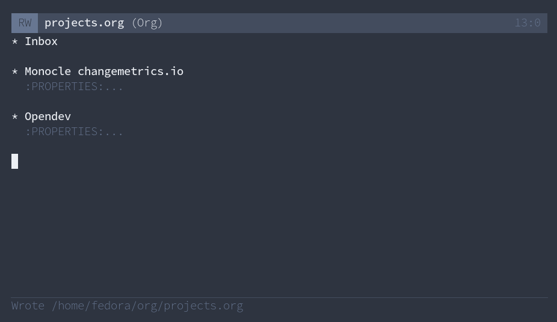
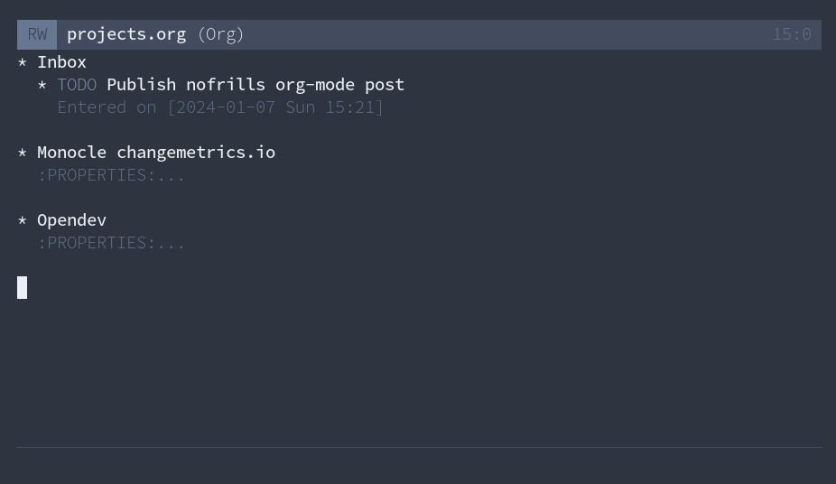

In this post I document a setup to manage projects with [org-mode][org-mode] and [org-ql][org-ql].


## Context

At work, we share an etherpad document as a support for two main ceremonies:

- Daily standup meeting where each members provides an update on their work.
- Semi-monthly review meeting where we summarize our work for the broader organization.

Without an organizational system, we can simply recall what happened and fill out the document right before the meeting starts.
It is more efficient to implement a system to keep track of tasks as they come up, so that you don't have to rely solely on your memory.


## Introducing org-mode

[org-mode][org-mode] is arguably the most advanced system for taking notes and organizing things.
It is a free software that comes with Emacs.

In the next section I focus on the **todo** feature, but note that org-mode comes with many additional features such as:
- Calendar, agenda and clocking.
- Structural editor with markup language.
- Literate source code editor with evaluation similar to Jupiter notebooks.

[org-mode]: https://orgmode.org/features.html


## Capturing tasks

Use the `org-capture` command to enter a task. This can happen in one of the following situations:

- To record something that needs to be done, e.g. a planned task like "implement a feature".
- To record something that has been completed, e.g. an unplanned task like "fix the logserver".

To tell `org-capture` where to write down a task, create the following template at `~/org/projects.org`:

```lisp
* Inbox

* Monocle changemetrics.io
:PROPERTIES:
:CATEGORY: Monocle
:END:

+ Opendev
:PROPERTIES:
:CATEGORY: Opendev
:END:
```

This document contains three headings showing how properties can be attached to create categories.
Here is how that looks like in [nano-emacs][nano-emacs]:

:::{.flex .items-center .justify-center}

:::

Then in `~/.emacs.el` write the following configuration:

```lisp
;; Configure where tasks are written
(setq org-capture-templates
      '(
        ("t" "todo" entry (file+headline "~/org/projects.org" "Inbox")
         "* TODO %?\n/Entered on/ %U\n")
        ))

;; Define a new helper function
(defun tc/org-capture-todo ()
  "Directly capture a todo."
  (interactive)
  (org-capture nil "t"))

;; Press F5 to capture a task (same key as quicksave in KSP)
(define-key global-map (kbd "<f5>") 'tc/org-capture-todo)
```

Now pressing <kbd>F5</kbd> create the following window:

:::{.flex .items-center .justify-center}

:::

After filling a description of the task, you have three options:

- <kbd>C-c C-c</kbd> *org-capture-finalize*: add the task to the inbox.
- <kbd>C-c C-w</kbd> *org-capture-refile*: refile the task to a project.
- <kbd>C-c C-k</kbd> *org-capture-kill*: abort the capture process and close the window.

Then your `projects.org` documents is updated with:

:::{.flex .items-center .justify-center}

:::

## Managing tasks

Use `M-x org-refile` to move a task, and press <kbd>tab</kbd> to get a list of destination:

:::{.flex .items-center .justify-center}

:::

For example, pressing <kbd>M</kbd> <kbd>tab</kbd> <kbd>enter</kbd> moves the task to the monocle project.


To change the status of tasks use `M-x org-todo`, this will cycle between NA, TODO and DONE.
Note that this can be used to turn any heading into a task too.

In `~/.emacs.el` add the following setting to attach a CLOSED property when a task is done.

```lisp
;; Keep track of when the task was completed
(setq org-log-done 'time)
```

Running `M-x org-todo` on the example task results in:

:::{.flex .items-center .justify-center}

:::

## Listing tasks

To list tasks, configure where to look for tasks:

```lisp
;; Tell org-agenda where are the org files
(setq org-agenda-files '("~/org"))
```

Then running `M-x org-todo-list` display the global list of tasks:

:::{.flex .items-center .justify-center}

:::

Click on a task to jump to its location in the `projects.org` file.
You can also manage the task directly from the list, e.g. using `org-todo` to change its status.

You can also run `M-x org-agenda-filter` to narrow down the listing by category.


## Creating report with org-ql

[org-ql][org-ql] lets you search the tasks to produce custom report.

Install the library by adding the following to your `~/.emacs.el`:

```lisp
;; Install org-ql through melpa
(add-to-list 'package-archives '("melpa" . "https://melpa.org/packages/") t)
(package-initialize)
(package-install 'org-ql)
```

While you can use org-ql interactively, for example by running `M-x org-ql-search`,
it's also possible to fully customize the output using Emacs native configuration language.

For example, a daily standup report needs to look like this:

```lisp
YYYY-MM-DD

$USER:
* entry
```

Here is how to render your tasks for this particular format:

```lisp
;; string manipulation library from https://github.com/magnars/s.el
(require 's)
(require 'org-ql)

;; The inverse of s-lines
(defun s-unlines (xs) (s-join "\n" xs))

(defun tc/daily-format-item (item)
  "Format 'org-ql-select' output. ITEM is a prop list."
  (let* ((properties (cadr item))
         (title (plist-get properties :raw-value))
         (category (org-entry-get (plist-get properties :org-marker) "CATEGORY")))
    (format "* %s - %s" (s-pad-left 13 " " category) title)))

(defun tc/daily-format (items)
  "Format all ITEMS."
  (let* ((today (format-time-string "%Y-%m-%d"))
         (header (list today "" user-login-name))
         (body (mapcar 'tc/daily-format-item items)))
    (s-unlines (append header body))))

(defun tc/mk-daily-report ()
  "Produce a report for team daily."
  (interactive)
  ;; todo: adjust the from timestamp to a single day for tue-wed-thu-fri
  (let* ((entries (org-ql-select "~/org/projects.org"
                    '(and (done) (ts :from -3 :to today))
                    :action 'element-with-markers))
         (report (tc/daily-format entries))
         (*buffer* (get-buffer-create "*tc/daily*")))
    (with-current-buffer *buffer*
      (erase-buffer)
      (insert report))
    (switch-to-buffer-other-window *buffer*)))

(define-key global-map (kbd "<f6>") 'tc/mk-daily-report)
```

Then running `M-x tc/mk-daily-report` creates a new window with the following content, ready to be shared with the team:

:::{.flex .items-center .justify-center}

:::

## Conclusion

This post demonstrated a minimal usage of org-mode to perform project management.
To learn more about org-mode, I recommend the following guide by Nicolas P. Rougier: [Get Things Done with Emacs](https://www.labri.fr/perso/nrougier/GTD/index.html).

To learn more about emacs in general, I recommend starting with [nano-emacs][nano-emacs] to run the help-with-tutorial.

[nano-emacs]: https://github.com/rougier/nano-emacs#gnu-emacs--n-%CE%BB-n-o
[org-ql]: https://github.com/alphapapa/org-ql#readme
