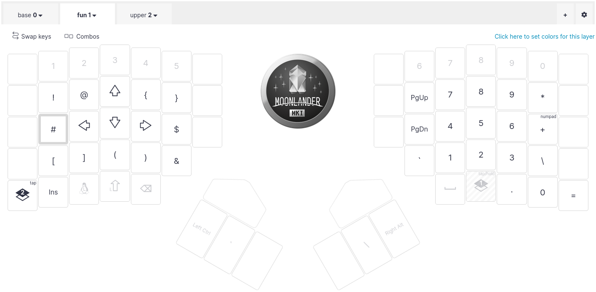
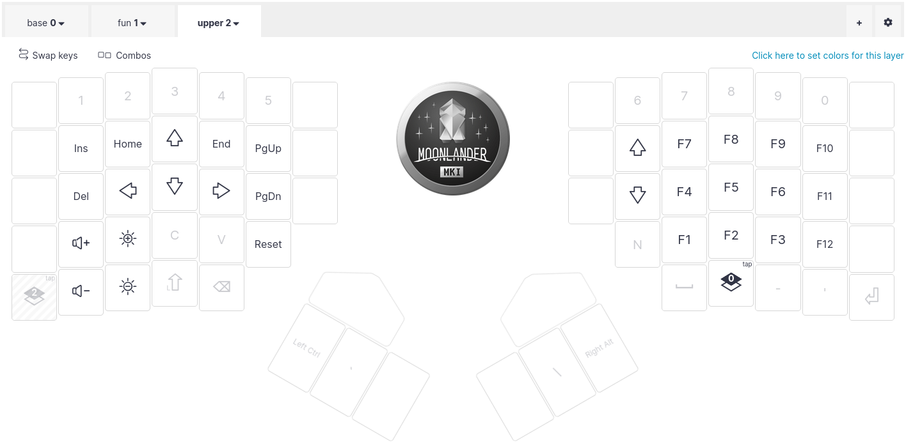
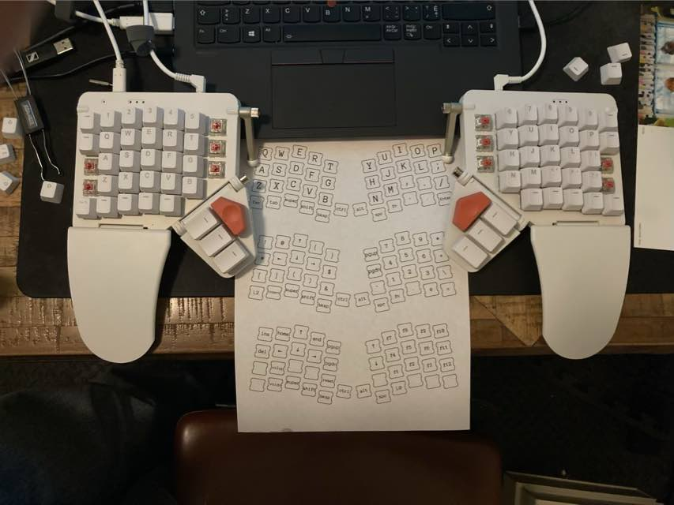

This post is a live journal to document my switch to using an ergonomic keyboard.
I am writing it as suggested by a colleague, and I hope that you'll find this entertaining and useful.

## Thu, Oct 19: Making a decision

To put this into context: I have been using various keyboards to write copious amounts of code for almost 30 years now.
I used Emacs, then Vim, and now mostly vanilla Emacs with the default key bindings.
My favorite keyboard layout is the 75%, but after relocating back from South Korea, the keyboards I bought all broke right after the warranty was over.
That was really frustrating because I was not able to fix them and I don't want to produce waste.

Thus, last year I switched back to using my laptop keyboard and I developed a bad habit of reaching the default arrow keys using my pinky.
It's worth noting that I don't use fancy navigation or browser plugins and that I rely on the arrows key for reading.
After a while, my right hand became painful and I worried that I could get a serious injury if I kept going like that.

A couple of weeks ago, a friend told me about his switch to a split keyboard and that sparked my curiosity.
After spending half a day checking what I could get, I settled on the Moonlander.
There are lots of option, and it's difficult to make a choice, and since I am not familiar with these systems, the Moonlander looked like the easiest option since it comes pre-built.
I just wished they had a version without any LEDs.

## Thu, Oct 26: Waiting

After making the purchase, my curiosity grew over the days, and I was wondering if I made the right decision.
Thankfully, ZSA, the producer of the Moonlander, has really good support and they provide great resources to get started.

Then I read the following resources:

* [Designing a 36-key custom keyboard layout](https://peterxjang.com/blog/designing-a-36-key-custom-keyboard-layout.html)
* [How do you use layers on your keyboard?](https://lobste.rs/s/2ps6iq/how_do_you_use_layers_on_your_keyboard)

… and these made me wonder if I shouldn't have picked the [atreus](https://shop.keyboard.io/products/keyboardio-atreus).

Anyways, yesterday, on a Friday morning I got the "out for delivery" notification which prompt me to prepare the layout.
I didn't want to waste time tinkering my own system, and I simply replicated the layout technomancy generously shared [here](https://atreus.technomancy.us/cheat.pdf).
Using the online configurator, I made this config: https://configure.zsa.io/moonlander/layouts/J5QlB/latest/0

* The base layer:

* The fun layer:

* The upper layer:

## Fri, Oct 27: Unboxing

On Friday evening, eight days after making the order, I got the keyboard.
I flashed the initial layout I prepared and quickly realized that the learning curves was going to be too steep.
This was just too much of a change and I couldn't see how I would be able to get used to such a different setup.
Thus, I made the following adjustments to get something usable more quickly:

* add back the numbers row.
* assign the tab key where it used to be.
* assign a key to turn off the leds.
* remove the unassigned key-cap to help me place my fingers correctly.

After re-flashing the firmware, I got something a bit more usable, but it still felt like using an alien device or an advanced technology:

My first task was to start Emacs, by typing alt-f2 and "emacs". That was quite a challenge since the function keys are in the upper layer.
This was a big relief because it felt like something I can get used to.
After this first success, it was already getting late and I call it a day.

## Sat, Oct 28: First contact

On Saturday, I got some practice by writing this post, my goal was to get used to:

* the ortho layout, in particular the `c` key location.
* the `enter`, `space`, `ctrl` and `alt` location.

Writing prose was surprisingly easy to get used to, however, editing is a very different beast.
I realized that I don't even know what are the keys to make basic operations such as selecting, copy/pasting or undoing.
These are so fundamental that I am relying on muscle memory to hit the right keys.
So I had to manually perform these actions on my previous keyboard to take note of the keys I was hitting.

On one hand it is irritating having to slow down to recall new hand motions, but on the other hand, it is satisfying to see this process getting continuously faster as I am using the keyboard more and more.
I might never reach the proficiency I had before, but it feels like I should achieve a satisfying speed in a couple of weeks.

I am not doing this switch to become faster anyway, it's an investment for my well-being, and I can already feels that it is paying off:
my wrists and fingers barely moved as I am writing this post.

## Sun, Oct 29: Let the fun begin

On Sunday, I focused my practice on using the fun layer.
This layer systems is a neat feature that lets you remap keys, similarly to what the shift key does.
This is what really lets you reduce hand motions.

There are 4 options to switch layers, and for now I'm using the `TT` mode, which stands for *tap* *toggle*.
I can access the fun layer by holding the key down, or I can toggle the layer by tapping the key.
Similar to the caps lock, the keyboard has LEDs to indicate which layer is currently activated.
I think it would be easier without the toggle, but since the navigation is on the fun layer, it can be useful to keep it active by tapping the key.

It quickly became natural to hold the fun key to access arrows keys and symbols such as `#` or `*`.
My goal is to eventually get rid of the numbers row, and using a different modifiers for such symbols is not as difficult as I thought it would be.
On the contrary, it is actually easier because using symbols now requires less motion.

I have also realized that the layout I was using didn't have the `%` key.
Perhaps there is a combo to send this symbol, but since I'm aiming for a 44keys layout, and the one I copied was a 42keys layout, I had a spare key to use for `%`.
I am not sure it's a good idea to do such change as I believe the default layout is well thought out.
But I guess it's fine to try changing one key at a time and see if it works better.

I forgot to mention yesterday that while ergonomics was the primary reason for using such a keyboard,
I also enjoy the fact that this keyboard is designed for long term usage with a durable design.
It looks like this one will not end up in the trash and I will be able to repair failures that will happen in the future.

## Mon, Oct 30: Getting to work

I am not going to lie, today was rough. My colleagues were supportive and patient with me, but using such a new device took a mental toll on me.
The day started with an innocuous tmux session to fix a service that was not starting, and I stuttered to perform most actions.
This slowdown is annoying because by the time I typed something, I almost forgot the context of what I was doing.

Perhaps I shouldn't be using the new keyboard full time and I should be taking breaks using my old one.
But I also enjoy the new physical experience where my fingers barely move anymore.
As long as nothing really urgent happens, I'll probably just push trough the learning curve.

Here are the list of changes I made to my layout:

* Similar to the change I made for the `tab` key, I moved the `'` key next to the `p` key. I am using my palms to hit the outer keys (`esc` on the left and `enter` on the right) and the adjacent keys are hard to reach for me.
  I think this is happening because I retro fitted a straight 5x4 layout by offsetting the lower row.
  Anyway, changing a single key is easy to get used to.
* I also changed my push-to-talk combo for mumble [from `<Super>F2` to `<Shift>Escape`](https://github.com/TristanCacqueray/gnome-mumble-push-to-talk/commit/60ff973b15028d1f16bb14c644992567cbcb59c8).
  I am not sure how to access the upper layer quickly enough.
  I can hit `fn`-`L2`-`F1` to start a eshell fine, but that's not practical for mumble or running gnome command.

I am also having troubles with windows management: I am using the default awesomewm keys to send a window to a different workspace with `super`-`shift`-`NUM`.
This no longer works well because `super` and `shift` are next to each others.
Well that will be a story for another day.

By the end of the day, I still managed to push a bunch of commits, and I am getting a bit more comfortable within emacs.

## Tue, Oct 31: Typing

After two full days using the keyboard, I have to say that I'm getting used to the new motions, and I can feel that with a bit more practice I'll be done with the initial learning curve.
I was a skeptical at first, but I'm glad that such a change is doable.
I did a bit of monkeytype.com and I am presently at 60 WPM for English, and about 25 WPM for Rust.

I have also read these reviews which match my impressions:

* https://no-kill-switch.ghost.io/keyboardio-atreus-yeah-or-meh-review/
* https://arslan.io/2021/05/19/a-review-of-my-first-split-keyboard-moonlander-mk1/

Here are the list of changes I made to my layout:

* I was missing the `^` key. Of course I could reach it with `Shift`-`6`, but as I said, I'd like to get rid of the numbers row eventually so I needed a replacement.
* I was often toggling the fun layer by mistake, so I switched from tap/toggle to hold. I guess that's why the arrow keys are also on the upper layer, which I assume is the one that needs to be toggled.

I don't expect more changes, I just wished there was a better location for the enter key. Here is the link if you want to check out what I am using: https://configure.zsa.io/moonlander/layouts/J5QlB/latest/0

## Wed, Nov 1: Holding keys

As I was practicing I realized that the space key's location was not ideal. And to reach the `-` key I had to move my thumb all the way under my hand.
I was also reluctant to use the thumb cluster as it was hard to reach when the keyboard is tented.
But after putting the keyboard flat, as suggested in the getting started guide, I found it was quite a natural place to rest my thumbs. So I moved the `backspace` and `space` keys there.

And since now is a good time to do such adjustments, I am also experimenting with a multi function key to make the `Alt` key send `Enter` on tap.
Here is my new layout:

It wasn't fun getting used to the new positions, and doing such tweaks was exactly what I wanted to avoid.
Hopefully, it didn't took too long to get up to speed, and after a couple of hours of training I reached about 30 WPM for Rust code.

## To be continued
