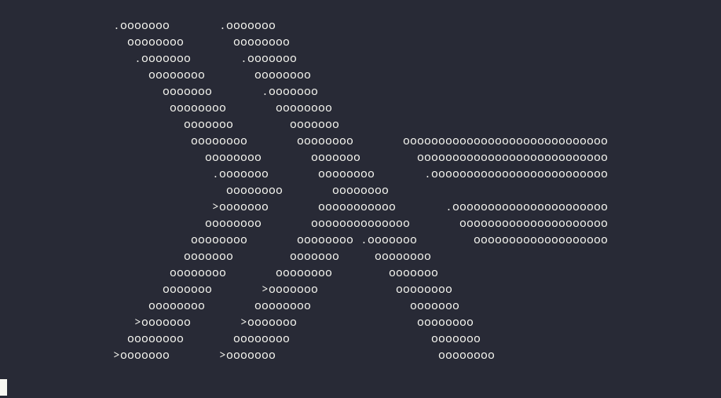

I contributed 6 games to the 2023 February [Haskell Tiny Game Jam](https://github.com/haskell-game/tiny-games-hs).

I also investigated how to run the game online with: https://github.com/TristanCacqueray/tiny-game-haskell-wasm and https://github.com/TristanCacqueray/tiny-game-server/

:::{.flex .flex-col .items-center .justify-center .place-content-center}
:::{.w-full .text-center}
[prelude-10-80/pure-doors](https://github.com/haskell-game/tiny-games-hs/tree/main/prelude/pure-doors)
:::


```haskell
#!/usr/bin/env runhaskell
main = interact (go (-1) (map (\n -> (5, mod n 8)) nums) 3)
draw c mid pos = "|" <> r pos c <> mid <> r (7 - pos) c <> "|\n"
(r, t, nums) = (replicate, draw ' ' " " 7, 1 : 2 : zipWith (+) nums (tail nums))
s 5 (0,d) p x c = if d /= p then "Crash!" <> c [] else s 5 (head x) p (tail x) c
s 5 (l,d) p x c = draw ' ' "^" p <> "[jkl]> " <> c ((l - 1, d) : x)
s n e@(l,d) p x c = (if (n==5-l) then draw '-' " " d else t) <> s (n+1) e p x c
go x m p i = "\ESCcpure-doors\n" <> s 0 (head m) p (tail m) (\m -> case (m,i) of
 (_:_, c:'\n':xs) | c > 'h' && c < 'n' -> go (x+1) m (p + fromEnum c - 107) xs
 _ -> (if x>5 then " GG, your score is: " <> show (div x 5) else "") <> "\n")
```

An adventure game. I like this project because it uses lazyness to achieve a pure `String -> String` implementation.
:::

---

:::{.flex .flex-col .items-center .justify-center .place-content-center}
:::{.w-full .text-center}
[prelude-10-80/tiny-brot](https://github.com/haskell-game/tiny-games-hs/tree/main/prelude/tiny-brot)
:::


```haskell
#!/usr/bin/env runhaskell
w=80;h=24;z2 (cx,cy) (x,y) = (cx +(x*x-y*y), cy +2*x*y)
r=(-0.5);p=[(x,y)|y<-[0..h],x<-[0..w+1]];mb=(-1.4844,0)
main = interact (foldMap go . zip [00..] . mappend "g")
dot (x,y) = let l=abs(x*y) in if isNaN l then 42 else l
coord z (c,d)(x,y) = (c+z*(x-w/2)/w, (d+z*(y-h/2)/h)*r)
brot c p = dot . last . take c . iterate (z2 p) $ (0,0)
zoom x = 4.18-4.179*(1-cos(x/10)**8); d _ (81,_) = "\n"
d z c = if brot 150 (coord z mb c)>20 then " " else "λ"
go (x,_)="\ESCctiny-brot\n" <> concatMap (d (zoom x)) p
-- ^10 ----------------------------------------- 55> --
```

I like this one because it manages to show self-similarity.
:::

---

:::{.flex .flex-col .items-center .justify-center .place-content-center}
:::{.w-full .text-center}
[hackage-10-80/lazy-march](https://github.com/haskell-game/tiny-games-hs/tree/main/hackage/lazy-march)
:::


```haskell
#!/usr/bin/env -S stack script --resolver lts-20 --package ansi-terminal-game
import Terminal.Game;w=80;h=20;go t=foldr (m (t/10) 0)(blankPlane (i w) (i h)) p
p=[(i x, i y, (x/w*2-1, (y/h*2-1)*0.2, -10)) | y<-[0..h], x<-[0..w]];s=sin;c=cos
main=playGame (Game 13 0 (\_ t _->t+1) (const go) (const False));i=round
l3 (x,y,z)=sqrt(x*x+y*y+z*z);m3 (x,y,z)=(max x 0, max y 0, max z 0)
sdBox h w (x,y,z)=l3(m3(abs x-w,abs y-h,abs z-0.03));o(x,y,z)=(x+0.05, y-0.4, z)
scene p=min (sdBox 0.8 0.05 (rot 1 p)) (sdBox 0.4 0.04 (o (rot (-1) p)))
rot t (x,y,z)=(x*cos t - y*sin t, x*sin t + y*cos t, z);m _ 10 _ = id
m t n (ix,iy,(x,y,z))=let a=x*cos(t)-z*sin t;c=x*sin(t)+z*cos t;d=scene(a,y,c)in
  if d <= 0.01 then (iy,ix) % cell '%' else m t (n+1) (ix,iy,(x,y,z+d))
```

A 3d render demo using a ray-marcher.
:::

---

:::{.flex .flex-col .items-center .justify-center .place-content-center}
:::{.w-full .text-center}
[default-10-80/tsp](https://github.com/haskell-game/tiny-games-hs/tree/main/default/tsp)
:::


```haskell
import System.IO; import Control.Concurrent; import Data.ByteString(elemIndices,
 hGetNonBlocking,hPut); import Data.ByteString.Char8(pack); q=hPut stdout . pack
main=hSetBuffering stdin NoBuffering>>hSetEcho stdin False>>go i; o=True; m=max;
i=(-30,0,0,0,' ');s v|v>=0=">"|o="<";c t|t<0=show (t`div`10)|o="";l=2900;d="--,"
p 0(_,p,v,_,_)="VEL "++show v++" | ALT "++show p;p 1_=d++[' '|_<-[0..69]]++"~|~"
p 2(t,p,v,_,f)=[' '|_<-[0..floor(p/40)]]++f:s v++c t;z t v|v>(-50)=print t|o=q""
r s=q$"\ESCc=<< TSP >>=   | "++(unlines$map(flip p s)[0..2]);y=flip elemIndices;
go s=r s>>threadDelay 100000>>(hGetNonBlocking stdin 42>>=e s);e(t,p,v,h,_)i=let
 j=(/=[]).y i;f=j 102;r=j 114;g|f='*'|r='['|o=' ';n|f=5|r=(-5)|o=0;q=m 0(p+v-1);
 c|t<0=0|o=1;in if (q==0&&h>l) then z t v else go(t+1, c*q, c*(v+n-1), m h p, g)
```

```
You are a rocket pilot flying for the Tiny Space Agency (TSA).
Your goal is to deliver curry to the Tiny Space Station (TSS).
There is no time to loose, you need to go as fast as possible.
The world record, by Simon Kerman Jones, is under 9.9 seconds.
```
:::

---

:::{.flex .flex-col .items-center .justify-center .place-content-center}
:::{.w-full .text-center}
[base-10-80/flower-seeds](https://github.com/haskell-game/tiny-games-hs/tree/main/base/flower-seeds)
:::


```haskell
import System.IO;import Control.Concurrent;import System.Environment;o=True
r w=putStrLn("\^[cflower-seeds "++show w)>>traverse p(map c(g w));a[]=go i
a(b:_)=go(read b);c(a,d)=(z$60+d*cos a,z$0.5*(50+d*sin a));z=round;j=(-1)
i=(29.6,3,400);g(a,d,n)=take n$iterate(\(b,e)->(b+pi*a/90,e+d/30))(0,0)
p (x,y)=threadDelay 1000>>putStrLn("\^[["++show y++";"++show x++"f❤")
main = hSetBuffering stdin NoBuffering >> (getArgs >>= a); e(a,d,n)i=let
 b|i=='j'=j|i=='l'=1|o=0;e|i=='k'=j|i=='i'=1|o=0;m|i=='c'=(-1)|i=='v'=1|o=0
 in go (a+b/20,max 0.1(d+e/10),max 1(n+m*17));go w=r w >> (getChar >>= e w)
```

Use this game to draw a flower for your Valentine.
:::

---

:::{.flex .flex-col .items-center .justify-center .place-content-center}
:::{.w-full .text-center}
[default-10-80/lambda-ray](https://github.com/haskell-game/tiny-games-hs/tree/main/default/lambda-ray)
:::


```haskell
import Control.Concurrent; import System.Posix.Internals;w=100;q=0.4;n=min;c=cos
p=[(x/w*2-1,(y/20*2-1)*0.2)| y<-[0..20], x<-[0..w+1]];t=max 0;o=True;a=abs;s=sin
main=go 0;r t (x,y,z)=(x*c t - y*s t, x*s t + y*c t, z);v=sqrt;u _(1.02,_)= '\n'
u t(x,y)=m t 0(10*x,10*y,-5);b h w(x,y,z)=v(t(a x-w)**2+t(a y-h)**2+t(a z-q)**2)
go n=puts("\ESCc"++(map (u(n/6))p))>>threadDelay 100000>>go(n+1);h p@(x,y,z)=let
 a=b 5q;l=(x+3,y,z);i|y>=0=a(r(-1)l)|o=9;j|y<0=a(r 1l)|o=9;k=a(r 1p)
 c|y>0=a(r(-1)p)|o=9;m=b 5 2(r 1(x-6,y,z));g s=b 6 0.2 (r(pi/2)(x-1,y+s*q,z))
 e=max m(n(g 1)(g(-1))) in n(n i j)(n e(n k c));m _ 20 _=' ';m t n(x,y,z)=let
 a=x*c(t)-z*s t;b=x*s t+z*c t;nz=h(a,y,b+q)-h(a,y,b-q);ny=h(a,y+q,b)-h(a,y-q,b)
 d=h(a,y,b);g|nz<0='o'|ny<0='>'|o='.';r|d<0.01=g|o=m t(n+1)(x,y,z+d);q=0.001in r
```

This demo renders a rotating Haskell logo in 3D.

:::
