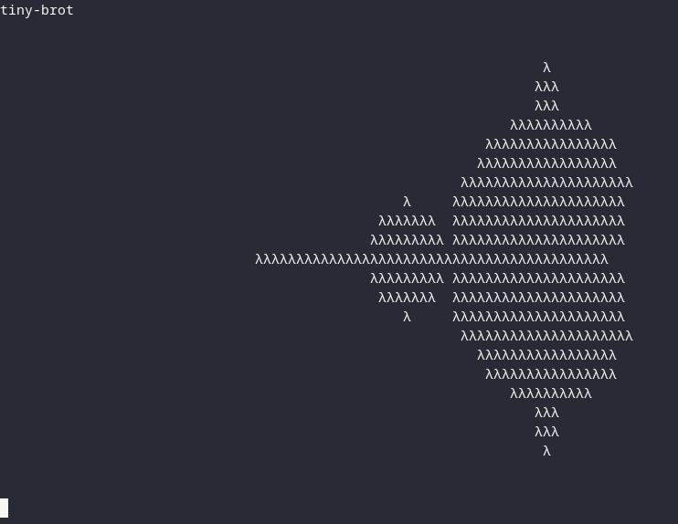

I contributed 3 games to the 2023 February [Haskell Tiny Game Jam](https://github.com/haskell-game/tiny-games-hs).

:::{.flex .flex-col .items-center .justify-center .place-content-center}
:::{.w-full .text-center}
[prelude-10-80/pure-doors](https://github.com/haskell-game/tiny-games-hs/tree/main/prelude/pure-doors)
:::


```haskell
#!/usr/bin/env runhaskell
main = interact (go (-1) (map (\n -> (5, mod n 8)) nums) 3)
draw c mid pos = "|" <> r pos c <> mid <> r (7 - pos) c <> "|\n"
(r, t, nums) = (replicate, draw ' ' " " 7, 1 : 2 : zipWith (+) nums (tail nums))
s 5 (0,d) p x c = if d /= p then "Crash!" <> c [] else s 5 (head x) p (tail x) c
s 5 (l,d) p x c = draw ' ' "^" p <> "[jkl]> " <> c ((l - 1, d) : x)
s n e@(l,d) p x c = (if (n==5-l) then draw '-' " " d else t) <> s (n+1) e p x c
go x m p i = "\ESCcpure-doors\n" <> s 0 (head m) p (tail m) (\m -> case (m,i) of
 (_:_, c:'\n':xs) | c > 'h' && c < 'n' -> go (x+1) m (p + fromEnum c - 107) xs
 _ -> (if x>5 then " GG, your score is: " <> show (div x 5) else "") <> "\n")
```

An adventure game. I like this project because it uses lazyness to achieve a pure `String -> String` implementation.
:::

---

:::{.flex .flex-col .items-center .justify-center .place-content-center}
:::{.w-full .text-center}
[prelude-10-80/tiny-brot](https://github.com/haskell-game/tiny-games-hs/tree/main/prelude/tiny-brot)
:::


```haskell
#!/usr/bin/env runhaskell
w=80;h=24;z2 (cx,cy) (x,y) = (cx +(x*x-y*y), cy +2*x*y)
r=(-0.5);p=[(x,y)|y<-[0..h],x<-[0..w+1]];mb=(-1.4844,0)
main = interact (foldMap go . zip [00..] . mappend "g")
dot (x,y) = let l=abs(x*y) in if isNaN l then 42 else l
coord z (c,d)(x,y) = (c+z*(x-w/2)/w, (d+z*(y-h/2)/h)*r)
brot c p = dot . last . take c . iterate (z2 p) $ (0,0)
zoom x = 4.18-4.179*(1-cos(x/10)**8); d _ (81,_) = "\n"
d z c = if brot 150 (coord z mb c)>20 then " " else "λ"
go (x,_)="\ESCctiny-brot\n" <> concatMap (d (zoom x)) p
-- ^10 ----------------------------------------- 55> --
```

I like this one because it manages to show self-similarity.
:::

---

:::{.flex .flex-col .items-center .justify-center .place-content-center}
:::{.w-full .text-center}
[hackage-10-80/lazy-march](https://github.com/haskell-game/tiny-games-hs/tree/main/hackage/lazy-march)
:::


```haskell
#!/usr/bin/env -S stack script --resolver lts-20 --package ansi-terminal-game
import Terminal.Game;w=80;h=20;go t=foldr (m (t/10) 0)(blankPlane (i w) (i h)) p
p=[(i x, i y, (x/w*2-1, (y/h*2-1)*0.2, -10)) | y<-[0..h], x<-[0..w]];s=sin;c=cos
main=playGame (Game 13 0 (\_ t _->t+1) (const go) (const False));i=round
l3 (x,y,z)=sqrt(x*x+y*y+z*z);m3 (x,y,z)=(max x 0, max y 0, max z 0)
sdBox h w (x,y,z)=l3(m3(abs x-w,abs y-h,abs z-0.03));o(x,y,z)=(x+0.05, y-0.4, z)
scene p=min (sdBox 0.8 0.05 (rot 1 p)) (sdBox 0.4 0.04 (o (rot (-1) p)))
rot t (x,y,z)=(x*cos t - y*sin t, x*sin t + y*cos t, z);m _ 10 _ = id
m t n (ix,iy,(x,y,z))=let a=x*cos(t)-z*sin t;c=x*sin(t)+z*cos t;d=scene(a,y,c)in
  if d <= 0.01 then (iy,ix) % cell '%' else m t (n+1) (ix,iy,(x,y,z+d))
```

A 3d render demo using a ray-marcher.
:::
